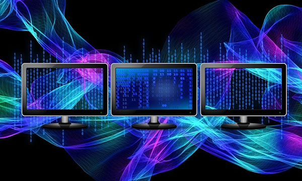

# {{ page.title }}

Welcome to Systems Librarianship 101.

The Orbis Cascade Alliance will present these lessons on [Systems community calls](https://www.orbiscascade.org/programs/systems/calls/) from September 2024 through June 2025. Recordings will be posted to the lesson pages after the calls.

## Alliance Resources

If you're a new systems librarian within the Alliance, see the [Systems Documentation](https://www.orbiscascade.org/programs/systems/documentation/) page for resources contributed by colleagues at member institutions, including the Primo VE and API toolkits, Alma Analytics trainings, and more.

The [Systems Demonstrations](https://www.orbiscascade.org/programs/systems/calls/demos/) page links to recordings and materials from presentations in community calls back to September 2016.

Announcements and conversations on current topics take place in the Systems Discussion email list. See [Alliance Email Lists](https://www.orbiscascade.org/about/contact/email-lists/) to subscribe. Archives are available to subscribing members through [Google Groups](https://groups.google.com/a/orbiscascade.org/g/sys-discussion).

## Citations
The image at the top of this page, "Three computer monitors sitting on top of each other. Binary monitor particles, computer communication," was published on [Pixabay](https://pixabay.com/) prior to July 2017 under the [Creative Commons CC0 1.0 Universal Public Domain Dedication](https://web.archive.org/web/20161229043156/https://pixabay.com/en/service/terms/) license.
